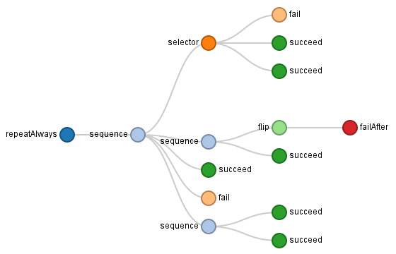

# Owylviz

Visualize the structure and activity of your [Owyl](https://github.com/eykd/owyl) behavior tree.

## Installation

```bash
$ pip2 install git+https://github.com/hansonrobotics/owylviz
```

or

```bash
$ git clone https://github.com/hansonrobotics/owylviz
$ python2 owylviz/setup.py install
```

## Usage

Create an `owylviz.OwylTree` instance with your owyl tree (without the root
`owyl.visit` node) as the argument.
```python
t = owyl.succeed()
viztree = owylviz.OwylTree(t)
```

Pick a unique room name for your tree and connect to a visualization server.

```python
from owylviz import Connection
viztree.connect(Connection('myroom'))

## You can have your room name automatically generated instead.
# viztree.connect()

## Or connect to a locally started web server.
# viztree.connect(Connection('myroom', 'localhost', 3000))
```

Open http://owylviz.herokuapp.com/myroom to see your tree.

If you want your tree to indicate which nodes are being iterated, don't visit
your regular tree, but use `viztree.tree_with_hooks` instead.

```python
v = owyl.visit(viztree.tree_with_hooks)
v.next()
```

## Full Example

```python
import owyl, time
from owylviz import OwylTree, Connection

t = owyl.repeatAlways(owyl.sequence(owyl.selector(owyl.fail(),
                                                  owyl.succeed(),
                                                  owyl.succeed()),
                                    owyl.sequence(owyl.flip(owyl.failAfter(after=5)),
                                                  owyl.succeed()),
                                    owyl.succeed(),
                                    owyl.fail(),
                                    owyl.sequence(owyl.succeed(),
                                                  owyl.succeed())))

viztree = OwylTree(t)
viztree.connect(Connection('myroom'))
v = owyl.visit(viztree.tree_with_hooks)

while True:
  v.next()
  time.sleep(0.2)
```



## Testing

```bash
$ python setup.py test
```

## Server

Owylviz python library communicates with a custom Nodejs web app, the source
code of which is stored in the **server** folder. An instance of that
web app runs at http://owylviz.herokuapp.com and can be used by multiple users
simultaneously.

But if you wish to run your own instance, you can do that locally.

```bash
$ cd owylviz/server
$ npm install
$ node index.js
```

Or deploy to your own heroku account.

```bash
$ cd owylviz
$ heroku create
$ git subtree push --prefix server heroku master
```
